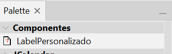
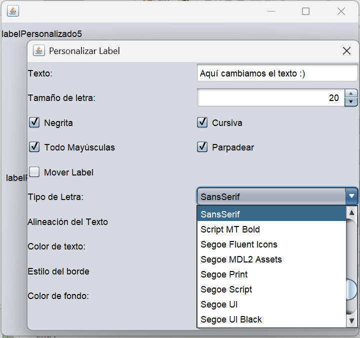
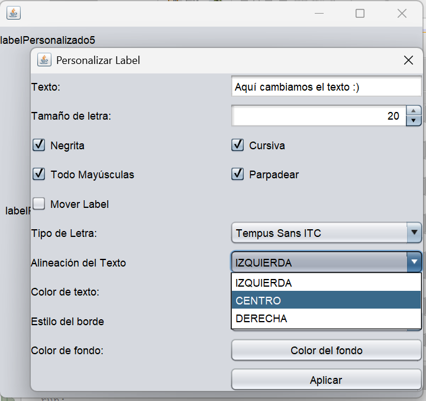
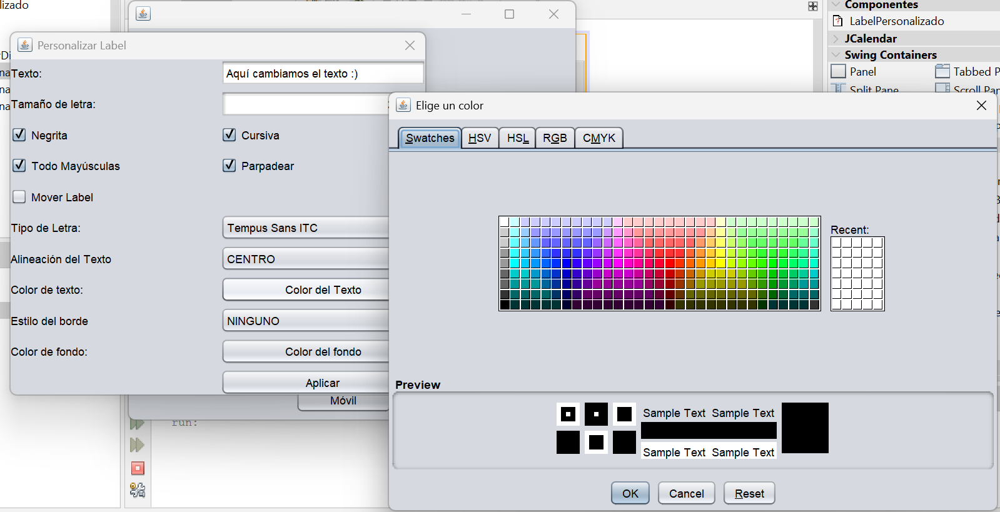
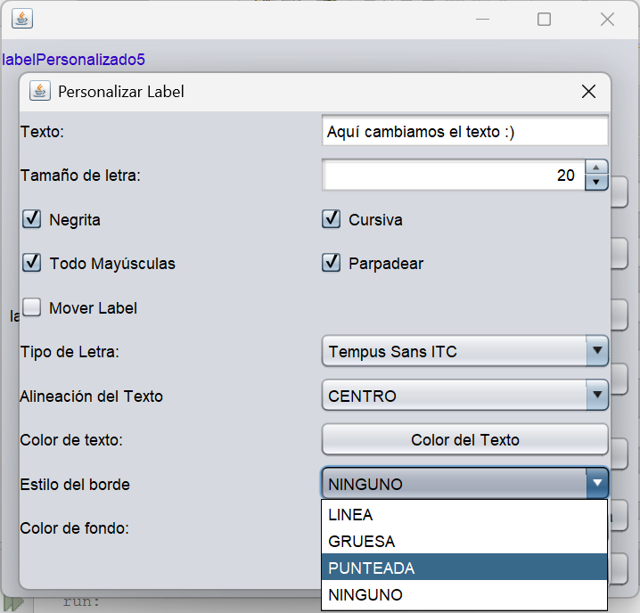
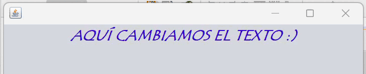

# LabelPersonalizado - Componente Java Swing

Es un componente personalizado que extiende de `JLabel`, permite personalizaciones visuales y comportamientos adicionales como parpadeo, movimiento y sonido al hacer clic derecho. Esta diseñado para usarse facilmente tanto en código como en el editor visual de NetBeans.

## Breve explicación

Este `LabelPersonalizado` es un componente visual reutilizable que permite:

- Cambiar el tipo y tamaño de fuente
- Aplicar estilos como negrita y cursiva
- Personalizar el color de texto y fondo
- Activar animaciones (parpadeo, movimiento)
- Reproducir un sonido al hacer clic derecho

Es ideal para interfaces dinamicas donde se requiere destacar ciertos elementos visualmente.

## Metodos y propiedades destacadas

| Método / Propiedad                   | Descripción                                                    |
|--------------------------------------|----------------------------------------------------------------|
| `setFontSize(int size)`              | Cambia el tamaño de la fuente                                  |
| `setFontFamily(String fontName)`     | Cambia el tipo de fuente                                       |
| `setBold(boolean bold)`              | Aplica o quita el estilo negrita                               |
| `setItalic(boolean italic)`          | Aplica o quita el estilo cursiva                               |
| `setTextColor(Color color)`          | Cambia el color del texto                                      |
| `setBackGroundColor(Color color)`    | Cambia el color de fondo                                       |
| `setParpadeo(boolean activar)`       | Activa/desactiva parpadeo del texto                            |
| `setMovil(boolean activar)`          | Activa/desactiva el movimiento horizontal                      |
| `setSonidoClickDerecho(String path)` | Define el sonido que se reproduce al hacer clic derecho |

## Instrucciones de uso

### 1. Agregar el componente a la paleta de NetBeans

1. Compila la clase `LabelPersonalizado.java` en tu proyecto.
2. Empaqueta la clase en un `.jar`:
   - Haz clic derecho sobre el proyecto → **Clean and Build**.
   - El archivo `.jar` se generará en la carpeta `dist/` (O puedes descargarlo directamente de este repositorio).
3. Abre otro proyecto o Jframe en NetBeans.
4. Ve a **Paleta de Componentes** -> clic derecho -> Nueva Categoria -> **Agregar desde JAR...**.
5. Selecciona el `.jar` generado o descargado.
6. Marca la clase `LabelPersonalizado` en la lista.
7. Asigna una categoría (ejemplo “CompPersonalizado”) y finaliza.
8. El componente aparecerá en la paleta.



### Usar el componente desde el diseñador

- Arrástralo desde la paleta al formulario.
- Usa la **ventana de propiedades** para cambiar valores visibles como el texto.

```java
labelPersonalizado1.setFontFamily("Arial");
labelPersonalizado1.setFontSize(24);
```

## Imágenes










# Colaboradores

[Álvarez Martínez Alessandro Santiago] (https://github.com/AleSantiagoAM)

[Velasco Velasco Heber] (https://github.com/EverV774)
